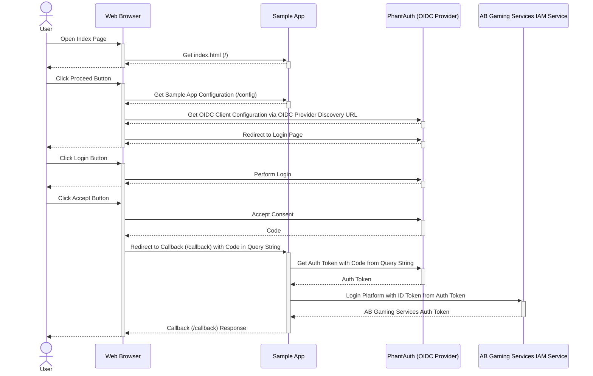

# AccelByte Gaming Services and 3rd Party OpenID Connect Login Integration Using AccelByte Java Extend SDK

## Overview

AccelByte Gaming Services provides [integration with OpenID Connect providers](https://docs.accelbyte.io/guides/access/3rd-party-platform-integration.html#openid-connect) as one of the 3rd party login integration options. Any OpenID Connect providers should work. The following sample app will show you how to do this with AccelByte Java Extend SDK and [PhantAuth](https://www.phantauth.net/), an OpenID Connect provider to simplify testing.

## Sample App

1. Clone [AccelByte Java Extend SDK](https://github.com/AccelByte/accelbyte-java-sdk) 
2. Go to [samples/oidc](https://github.com/AccelByte/accelbyte-java-sdk/tree/main/samples/oidc) folder
3. Follow the [README.md](https://github.com/AccelByte/accelbyte-java-sdk/blob/main/samples/oidc#readme) to setup and use the sample application

## How It Works

1. On sample app index page, when `Proceed` button is clicked: 
    - Get sample app configuration from `/config` endpoint 
    - Get OIDC Client configuration via OIDC provider `Discovery URL`, in this case `PhantAuth`
    - Redirect user to Phantauth Login and Consent page
2. After user is done with `Phantauth` Login and Consent page, `/callback` endpoint is called by `PhantAuth` with `code` in query string
3. In `/callback` endpoint: 
    - Get auth token from `PhantAuth` with `code` from the query string
    - Perform login platform using `Platform ID` and `ID Token` from `PhantAuth` auth token
    - After login platform is successful, we can try to call some AccelByte Gaming Services endpoints



## Code Walktrough

### index.html

When `Proceed` button is clicked, get sample app configuration from `/config` endpoint, get OIDC Client configuration via OIDC Provider `Discovery URL`, and redirect user to Phantauth Login and Consent page.


```javascript
$('#proceed').click(function (e) {
    $.ajax({
        url: "/config",
        method: 'GET',
    }).done(function (resConfig) {
        const config = JSON.parse(resConfig)
        $.ajax({
            url: config.discovery_url,
            method: 'GET',
        }).done(function (resDiscovery) {
            const oidcClient = new Oidc.OidcClient({
                authority: resDiscovery.issuer,
                client_id: config.client_id,
                redirect_uri: (window.location.href + 'callback?provider=' + config.platform_id),
                response_type: "code",
                scope: config.scope,
                filterProtocolClaims: false,
                loadUserInfo: false
            });

            oidcClient.createSigninRequest({
                state: {
                    bar: Math.random()
                }
            }).then(function (req) {
                window.location = req.url;
            })
        });
    })
});
```

### App.java

#### Endpoint `/config`

Returns sample app configuration.

```java
// Handler for oidcclient config request from index.html

get("/config", (req, res) -> {   
    final HashMap<String, String> oidcConfig = new HashMap<>();

    oidcConfig.put("platform_id", PH_AB_PLATFORM_ID);
    oidcConfig.put("discovery_url", PH_DISCOVERY_URL);
    oidcConfig.put("client_id", PH_CLIENT_ID);
    oidcConfig.put("client_secret", PH_CLIENT_SECRET);
    oidcConfig.put("scope", PH_SCOPE);

    return objectMapper.writeValueAsString(oidcConfig);
});
```

#### Endpoint `/callback`

Get auth token from `PhantAuth` with `code` from the query string and perform login platform using Platform ID and ID Token from PhantAuth auth token. After login platform is successful, we can try to call some AccelByte Gaming Services endpoints.

```java
// Handler for callback from PhantAuth

get("/callback", (req, res) -> {   
    // Get auth token from PhantAuth

    final Request authTokenRequest =
            new Request.Builder()
                .url("https://phantauth.net/auth/token")
                .post(
                    new FormBody.Builder()
                        .add("grant_type", "authorization_code")
                        .add("client_id", PH_CLIENT_ID)
                        .add("client_secret", PH_CLIENT_SECRET)
                        .add("redirect_uri", "http://localhost")
                        .add("code", req.queryParams("code") )
                        .build())
                .build();

    HashMap<String, String> authToken;

    try (Response authTokenResponse = oidcClient.newCall(authTokenRequest).execute()) {     
        if (!authTokenResponse.isSuccessful()) {
            return "Auth token request failed!";
        }

        authToken = objectMapper.readValue(authTokenResponse.body().string(), new TypeReference<HashMap<String,String>>() {});
    }

    // Extract id_token from auth token 

    final String idToken = authToken.get("id_token"); 

    // Check environment variables required by AccelByteSDK DefaultConfigRepository

    final ConfigRepository configRepository = sdk.getSdkConfiguration().getConfigRepository();

    if (configRepository.getBaseURL() == null || configRepository.getBaseURL().isEmpty() 
            || configRepository.getClientId() == null || configRepository.getClientId().isEmpty() 
            || configRepository.getClientSecret() == null || configRepository.getClientSecret().isEmpty())
    {
        return "Missing one or more environment variables required by AccelByte SDK";
    }
    
    // Login to AccelByte using the corresponding OIDC provider configured in admin portal (PhantAuth) and id_token we just obtained

    if (!sdk.loginPlatform("phantauth", idToken))   
    {
        return "Login platform failed!";
    }
    
    // Try to call AccelByte API after login success
    
    final OAuth20Extension oauth20Extension = new OAuth20Extension(sdk);
    final GetCountryLocationV3 getCountryOperation = GetCountryLocationV3.builder()
            .build();
    final OauthmodelCountryLocationResponse getCountryResponse = oauth20Extension.getCountryLocationV3(getCountryOperation);

    return "Success: " + objectMapper.writeValueAsString(getCountryResponse);
});
```
