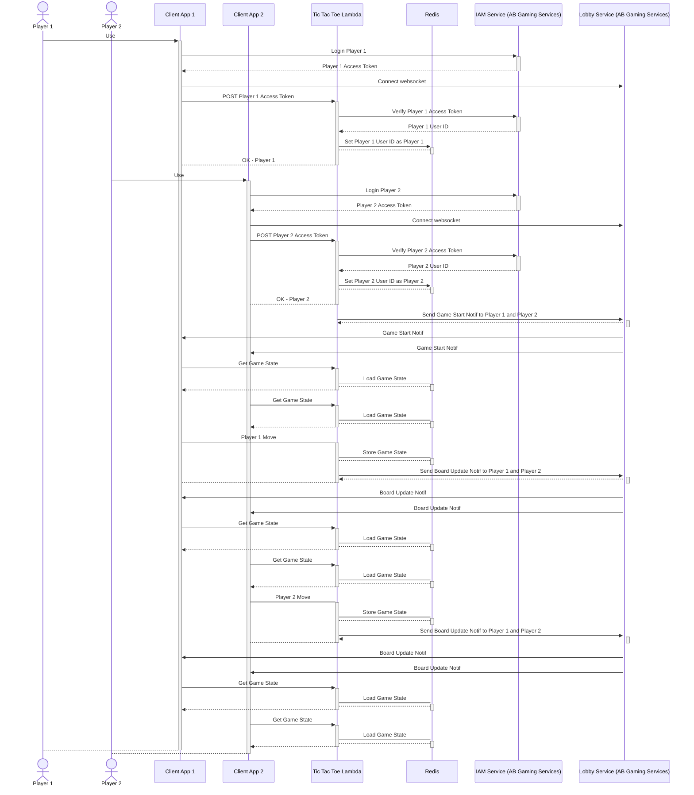

# Tic Tac Toe Game using AccelByte Java Extend SDK

## Overview

We can create a simple tic tac toe game with AccelByte Gaming Services and AWS Lambda developed using AccelByte Java Extend SDK. 

The sample app consists of two parts: the lambda itself and the client app that is used by players.

## Sample App

1. Clone [AccelByte Java Extend SDK](https://github.com/AccelByte/accelbyte-java-sdk) 
2. Go to [samples/tic-tac-toe](https://github.com/AccelByte/accelbyte-java-sdk/tree/main/samples/tic-tac-toe) folder
3. Follow the [README.md](https://github.com/AccelByte/accelbyte-java-sdk/blob/main/samples/tic-tac-toe#readme) to setup and use the sample application

## How It Works

1. Player #1 client app logs in to AB Gaming Services and get an access token.
2. Player #1 client app connects to AB Gaming Services Lobby Service websocket and wait for messages from tic tac toe lambda.
2. Player #1 client app post access token to tic tac toe lambda `/start` endpoint.
3. Receiving client app post data, tic tac toe lambda `/start` endpoint handler performs the following:
    - Contact AB Gaming Services to verify player #1 access token and get the user id.
    - Check Redis to see if there is a player waiting. If no, then store player #1 user id as player #1.
    - If there is an existing game recorded in Redis, offer to clear it first. This sample app only support a single tic tac toe game at one time.
4. Player #1 client app waits for player #2.
5. Player #2 client app logs in to AB Gaming Services and get an access token.
6. Player #2 client app connects to AB Gaming Services Lobby Service websocket and wait for messages from tic tac toe lambda.
7. Player #2 client app post access token to tic tac toe lambda `/start` endpoint.
8. Receiving client app post data, tic tac toe lambda `/start` endpoint handler performs the following:
    - Contact AB Gaming Services to verify player #2 access token and get the user id.
    - Check Redis to see if there is player #1 waiting. If yes, then store player #2 user id as player #2.
9. Tic tac toe game starts. Player #1 moves first.
10. Player #1 and player #2 take turns to make a move until the game ends.



## Code Walktrough

### Client App

#### Login User to IAM Service (AB Gaming Services)

The access token is needed to call Tic Tac Toe lambda.

```java
System.out.print("Username: ");
final String username = System.console().readLine();
System.out.print("Password: ");
final String password = String.valueOf(System.console().readPassword());

final boolean isLoginOk = sdk.loginUser(username, password);

if (!isLoginOk) {
    System.out.println("Login user failed!");
    System.exit(1); // Login failed
}
```

#### Connect to Lobby Service (AB Gaming Services) Websocket and listen for messages

Only take action on game start or board update messages from Tic Tac Toe lambda.

```java
ws = OkhttpWebSocketClient.create(
        sdk.getSdkConfiguration().getConfigRepository(),
        sdk.getSdkConfiguration().getTokenRepository(),
        new WebSocketListener() {
        @Override
        public void onMessage(@NotNull WebSocket webSocket, @NotNull String text) {
            if (text != null && (text.contains("GAME START") || text.contains("BOARD UPDATE"))) {
            updateSignal.countDown();
            }
        }
        });
```

#### Start Game

Start game and figure out whether the user is assigned as player 1 or player 2.

```java
final Request startRequest =
        new Request.Builder()
            .url(lambdaUrl + "/start")
            .addHeader("Authorization", String.format("Bearer %s", userAccessToken))
            .post(RequestBody.create("{}", MediaType.parse("application/json")))
            .build();

try (Response lambdaResponse = lambdaClient.newCall(startRequest).execute()) {
    if (lambdaResponse.isSuccessful()) {
    final String body = lambdaResponse.body().string();
    player = body.contains("ok - player 1") ? 1 : 2;  // Set whether user is player 1 or player 2
    break;  // Stop here and proceed to play game
    }
}
```

#### Get Game State

Get game state when receiving game start or board update messages from AB Gaming Services Lobby Service sent by Tic Tac Toe lambda.

```java
final Request stateRequest =
    new Request.Builder()
        .url(lambdaUrl + "/state")
        .addHeader("Authorization", String.format("Bearer %s", userAccessToken))
        .get()
        .build();

String gameJson = null;

try (Response lambdaResponse = lambdaClient.newCall(stateRequest).execute()) {
    if (lambdaResponse.isSuccessful()) {
    gameJson = lambdaResponse.body().string();
    }
    else {
    System.out.println(lambdaResponse.body().string());
    System.exit(1); // Cannot get state
    }
}
```

#### Make A Move

If error is received, it is assumed as wrong move. 

```java
final Request moveRequest =
        new Request.Builder()
            .url(lambdaUrl + "/move")
            .addHeader("Authorization", String.format("Bearer %s", userAccessToken))
            .post(RequestBody.create(String.format("{\"move\" : \"%s\"}", moveIndex ), MediaType.parse("application/json")))
            .build();

try (Response lambdaResponse = lambdaClient.newCall(moveRequest).execute()) {
    if (!lambdaResponse.isSuccessful()) {
        System.out.println("Wrong move?");
        continue;
    }
}
```

### Tic Tac Toe Lambda

#### Verify Access Token and Get User ID

This is part of the /start endpoint handler. We verify user access token and get the user id if it is valid.

```java
final VerifyTokenV3 verifyTokenV3Op = VerifyTokenV3.builder().token(userAccessToken).build();

verifyTokenV3Op.setPreferredSecurityMethod(Operation.Security.Basic.toString());

final OauthmodelTokenResponseV3 verifyTokenV3Result = oauth20Wrapper.verifyTokenV3(verifyTokenV3Op);

final String userId = verifyTokenV3Result.getUserId();
```

#### Start game

This is part of the `/start` endpoint handler. Try to load existing game from Redis or create a new one. If there is a stale game in Redis, respond with error so that client app can offer to reset it. 

If there is no players yet, assign the current user id as player 1. Otherwise, assign the current user id as player 2. Finally, if both players are already assigned, notify all players that the game is starting and start the game.

```java
Game game = null;

try (final Jedis jedis = new Jedis(RedisHost)) {
    final ObjectMapper mapper = new ObjectMapper();

    String gameJson = jedis.get(GameKey);

    if (gameJson != null)
    {
        game = mapper.readValue(gameJson, Game.class);  // Load existing game
    }
    else {
        game = new Game();  // Create new game 
    }

    if (game.player1 == null) {
        game.player1 = userId;
    }
    else if (game.player2 == null) {
        game.player2 = userId;
    }
    else {
        return response
            .withStatusCode(503)
            .withBody(getErrorJson(50302, "There is an existing game"));
    }

    gameJson = mapper.writeValueAsString(game);

    jedis.set(GameKey, gameJson);
}

if (game.player2 == null) {
    // Stop here if we are waiting for player 2
    return response
        .withStatusCode(200)
        .withBody(getSuccessJson("ok - player 1")); 
}

// Continue if we found player 1 waiting

final ModelFreeFormNotificationRequest notifBody =
        ModelFreeFormNotificationRequest.builder()
            .topic(NotificationTopic)
            .message("GAME START")
            .build();

notifWrapper.freeFormNotificationByUserID(
    FreeFormNotificationByUserID.builder()
        .namespace(Namespace)
        .userId(game.player1)
        .body(notifBody)
        .build());

notifWrapper.freeFormNotificationByUserID(
    FreeFormNotificationByUserID.builder()
        .namespace(Namespace)
        .userId(game.player2)
        .body(notifBody)
        .build());

return response.withStatusCode(200).withBody(getSuccessJson("ok - player 2 - game start"));
```

#### Get Game State

This is part of `/state` endpoint handler. It loads game state from Redis and returns it to client that requested it.

The game state contains of user id of player 1 and player 2, the state of the board, and the state of the game.

```java
try (final Jedis jedis = new Jedis(RedisHost)) {
    final String gameJson = jedis.get(GameKey);

    return response.withStatusCode(200).withBody(gameJson);
}
```

#### Make A Move

This is part of `/move` endpoint handler. When a player move is received from client, first, it will be converted board row and column index. Then, the move will be executed and the board will be evaluated whether any player wins, draw, or the game continues. Finally, notify all clients when the game state update is done. 

```java
final int rowIdx = (moveIdx - 1) / 3;
final int colIdx = (moveIdx - 1) % 3;

Game game = null;

try (final Jedis jedis = new Jedis(RedisHost)) {
    final ObjectMapper mapper = new ObjectMapper();

    String gameJson = jedis.get(GameKey);

    game = mapper.readValue(gameJson, Game.class);  // Load existing game

    if (game.board[rowIdx][colIdx] == Player1Move || game.board[rowIdx][colIdx] == Player2Move)
    {
    return response
        .withStatusCode(503)
        .withBody(getErrorJson(50303, "Wrong move"));
    }

    game.board[rowIdx][colIdx] = game.state == State.PLAYER1_TURN ? Player1Move : Player2Move;   // Make a move

    game.state = nextState(game, rowIdx, colIdx);   // Update state

    gameJson = mapper.writeValueAsString(game);

    jedis.set(GameKey, gameJson);
}

final ModelFreeFormNotificationRequest notifBody =
        ModelFreeFormNotificationRequest.builder()
            .topic(NotificationTopic)
            .message("BOARD UPDATE")
            .build();

notifWrapper.freeFormNotificationByUserID(
    FreeFormNotificationByUserID.builder()
        .namespace(Namespace)
        .userId(game.player1)
        .body(notifBody)
        .build());

notifWrapper.freeFormNotificationByUserID(
    FreeFormNotificationByUserID.builder()
        .namespace(Namespace)
        .userId(game.player2)
        .body(notifBody)
        .build());

return response.withStatusCode(200).withBody(getSuccessJson("ok"));
```

#### Reset Game

This is part of `/reset` endpoint handler. When this is called by a client, the game will be reset so that a new game can be started.

```java
try (final Jedis jedis = new Jedis(RedisHost)) {
    jedis.del(GameKey);
}

return response.withStatusCode(200).withBody(getSuccessJson("ok"));
```