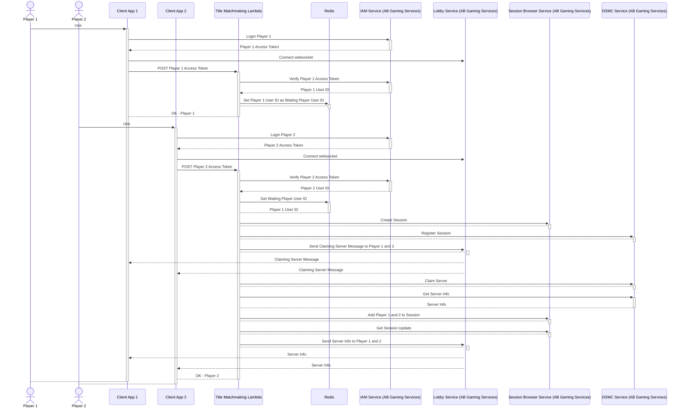

# Title Matchmaking Using AccelByte Java Extend SDK

## Overview

We can perform a simple matchmaking with AccelByte Gaming Services services and AWS Lambda developed using AccelByte Java Extend SDK. 

The sample app consists of two parts: the lambda itself and the client app that is used by players.

## Sample App

1. Clone [AccelByte Java Extend SDK](https://github.com/AccelByte/accelbyte-java-sdk) 
2. Go to [samples/title-matchmaking](https://github.com/AccelByte/accelbyte-java-sdk/tree/main/samples/title-matchmaking) folder
3. Follow the [README.md](https://github.com/AccelByte/accelbyte-java-sdk/blob/main/samples/title-matchmaking#readme) to setup and use the sample application

## How It Works

### Player 1

1. Client app logs in player #1 to AB Gaming Services and get an access token
2. Client app connect to AB Gaming Services Lobby Service websocket and waiting for messages from title matchmaking lambda
2. Client app post player #1 access token to title matchmaking lambda
3. Receiving client app post data, title matchmaking lambda performs the following:
    - Contact AB Gaming Services to verify player #1 access token and get the user id
    - Check Redis to see if there is a player waiting for matchmaking. If no, then store player #1 user id as the user who waits for matchmaking

### Player 2

1. Client app logs in player #2 to AB Gaming Services and get an access token
2. Client app connect to AB Gaming Services Lobby Service websocket and waiting for messages from title matchmaking lambda
2. Client app post player #2 access token to title matchmaking lambda
3. Receiving client app post data, title matchmaking lambda performs the following:
    - Contact AB Gaming Services to verify player #2 access token and get the user id
    - Check Redis to see if there is a player waiting for matchmaking. If yes, then take that user id as Player 1 for matchmaking
    - Contact AB Gaming Services to perform the following.
        - Create session
        - Register session to DSMC
        - Claim server
        - Get server info 
        - Add player to session
        - Get session update
        - Send notification for all players (Player #1 and #2) containing server info



## Code Walktrough

### Client App

#### Login User to IAM Service (AB Gaming Services)

```java
System.out.print("Username: ");
final String username = System.console().readLine();
System.out.print("Password: ");
final String password = String.valueOf(System.console().readPassword());

final boolean isLoginOk = sdk.loginUser(username, password);

if (!isLoginOk) {
    System.out.println("Login user failed!");
    System.exit(1); // Login failed
}
```

#### Connect to Lobby Service (AB Gaming Services) Websocket

```java
ws = OkhttpWebSocketClient.create(
    sdk.getSdkConfiguration().getConfigRepository(), sdk.getSdkConfiguration().getTokenRepository(),
    new WebSocketListener() {
        @Override
        public void onMessage(@NotNull WebSocket webSocket, @NotNull String text) {
            System.out.println("---");
            System.out.println(text);
        }
    });
```

#### Request matchmaking to title matchmaking lambda (POST player access token)

```java
final String lambdaUrl = System.getenv("LAMBDA_URL");   // e.g. http://localhost:3000/title-matchmaking
final String userAccessToken = sdk.getSdkConfiguration().getTokenRepository().getToken();
final int readTimeoutSeconds = 90;     // Give enough time to complete claim server process 

final Request lambdaRequest = new Request.Builder()
        .url(lambdaUrl)
        .addHeader("Authorization", String.format("Bearer %s", userAccessToken))
        .post(RequestBody.create("{}", MediaType.parse("application/json")))
        .build();

final OkHttpClient lambdaClient = new OkHttpClient().newBuilder().readTimeout(readTimeoutSeconds, TimeUnit.SECONDS)
        .build();

try (Response lambdaResponse = lambdaClient.newCall(lambdaRequest).execute()) {
    if (!lambdaResponse.isSuccessful())
    {
        System.out.println(lambdaResponse.body().string());
    }
}
```

### Title Matchmaking Lambda

#### Verify Access Token and Get User ID

```java
final VerifyTokenV3 verifyTokenV3Op = VerifyTokenV3.builder().token(userAccessToken).build();

verifyTokenV3Op.setPreferredSecurityMethod(Operation.Security.Basic.toString());

final OauthmodelTokenResponseV3 verifyTokenV3Result = oauth20Wrapper.verifyTokenV3(verifyTokenV3Op);

final String userId = verifyTokenV3Result.getUserId();
```

#### Create Matchmaking Request

Check Redis if there is a player already waiting. If no, then store the player's User ID as the waiting player User ID and stop to wait for Player #2. If yes, then take the waiting player User ID as Player #1 and own User ID as Player #2 and proceed with matchmaking.

```java
final String waitingUserIdKey = "waiting-user-id";

String waitingUserId = null;

try (final Jedis jedis = new Jedis(redisHost)) {
        waitingUserId = jedis.get(waitingUserIdKey);
        if (waitingUserId == null) {
                jedis.set(waitingUserIdKey, userId);
        } else {
                jedis.del(waitingUserIdKey);
        }
}

if (waitingUserId == null) {
        final ModelFreeFormNotificationRequest notifBody = ModelFreeFormNotificationRequest
                        .builder()
                        .topic("titleMatchmakingNotif")
                        .message("Waiting for player 2")
                        .build();

        notifWrapper.freeFormNotificationByUserID(
                        FreeFormNotificationByUserID.builder()
                                        .namespace(namespace)
                                        .userId(userId)
                                        .body(notifBody)
                                        .build());
} else {
        final ModelFreeFormNotificationRequest notifBody = ModelFreeFormNotificationRequest
                        .builder()
                        .topic("titleMatchmakingNotif")
                        .message("Found player 1 waiting")
                        .build();

        notifWrapper.freeFormNotificationByUserID(
                        FreeFormNotificationByUserID.builder()
                                        .namespace(namespace)
                                        .userId(userId)
                                        .body(notifBody)
                                        .build());
}

if (waitingUserId == null) {
        return response.withStatusCode(200)
                        .withBody(getSuccessJson("ok - player 1")); // Stop here if we are
                                                                    // waiting for an opponent
}

// Continue if we found an opponent waiting

final ModelPublicUserResponseV3 getUserResult = usersWrapper.publicGetUserByUserIdV3(
                PublicGetUserByUserIdV3.builder().namespace(namespace).userId(userId).build());

final String username = getUserResult.getUserName();

final String[] playerUserIds = new String[] { waitingUserId, userId };
```

#### Register Session to DSMC

```java
for (String uid : playerUserIds) {
        partyMembers.add(ModelsRequestMatchMember
                        .builder()
                        .userId(uid)
                        .build());
}

final List<ModelsRequestMatchParty> matchingParties = Arrays.asList(
                new ModelsRequestMatchParty[] {
                                ModelsRequestMatchParty
                                                .builder()
                                                .partyAttributes(new HashMap<String, Object>())
                                                .partyId(UUID.randomUUID().toString())
                                                .partyMembers(partyMembers)
                                                .build()
                });

final List<ModelsRequestMatchingAlly> matchingAllies = Arrays.asList(
                new ModelsRequestMatchingAlly[] {
                                ModelsRequestMatchingAlly
                                                .builder()
                                                .matchingParties(matchingParties).build()
                });

final net.accelbyte.sdk.api.dsmc.models.ModelsCreateSessionRequest createSessionDsmcBody = net.accelbyte.sdk.api.dsmc.models.ModelsCreateSessionRequest
                .builder()
                .clientVersion("1.0.0")
                .configuration("")
                .deployment("default")
                .gameMode("duel")
                .matchingAllies(matchingAllies)
                .region("")
                .podName("")
                .sessionId(sessionId)
                .namespace(namespace)
                .build();

dsmcSessionWrapper.createSession(
                net.accelbyte.sdk.api.dsmc.operations.session.CreateSession.builder()
                                .namespace(namespace)
                                .body(createSessionDsmcBody)
                                .build());
```

#### Claim Server (retry if we got 425 server is not ready)

```java
final ModelsClaimSessionRequest claimServerBody = ModelsClaimSessionRequest.builder()
                .sessionId(sessionId)
                .build();

dsmcSessionWrapper.claimServer(
                ClaimServer.builder().namespace(namespace).body(claimServerBody).build());
````

#### Get Server Info

```java
final net.accelbyte.sdk.api.dsmc.models.ModelsSessionResponse getSessionDsmcResult = dsmcSessionWrapper
                                        .getSession(net.accelbyte.sdk.api.dsmc.operations.session.GetSession.builder()
                                                        .namespace(namespace)
                                                        .sessionID(sessionId)
                                                        .build());

                        final ModelsServer server = getSessionDsmcResult.getSession().getServer();
```

#### Add Players to Session

```java
for (String uid : playerUserIds) {
        final ModelsAddPlayerRequest addPlayerToSessionBody = ModelsAddPlayerRequest.builder()
                        .userId(uid)
                        .asSpectator(false)
                        .build();

        sessionWrapper.addPlayerToSession(AddPlayerToSession.builder()
                        .namespace(namespace)
                        .sessionID(sessionId)
                        .body(addPlayerToSessionBody)
                        .build());
}
```

#### Get Session Update

```java
final ModelsSessionResponse getSessionResult = sessionWrapper.getSession(
                GetSession.builder()
                                .namespace(namespace)
                                .sessionID(sessionId)
                                .build());

if (!getSessionResult.getJoinable()) {
        return response.withStatusCode(503)
                        .withBody(getErrorJson(50302, "Session is not joinable"));
}
```

#### Send Server Info to All Players

```java
for (String uid : playerUserIds) {
        final ModelFreeFormNotificationRequest notifBody = ModelFreeFormNotificationRequest
                        .builder()
                        .topic("titleMatchmakingNotif")
                        .message(String.format("Done, server is at %s:%s", server.getIp(),
                                        server.getPort()))
                        .build();

        notifWrapper.freeFormNotificationByUserID(
                        FreeFormNotificationByUserID.builder()
                                        .namespace(namespace)
                                        .userId(uid)
                                        .body(notifBody)
                                        .build());
}
```